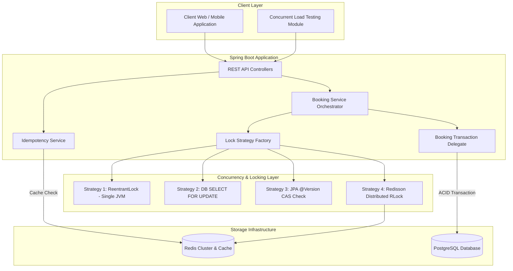
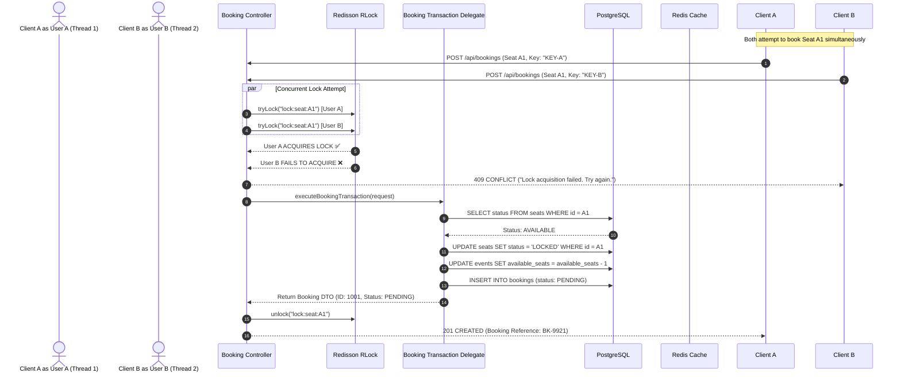
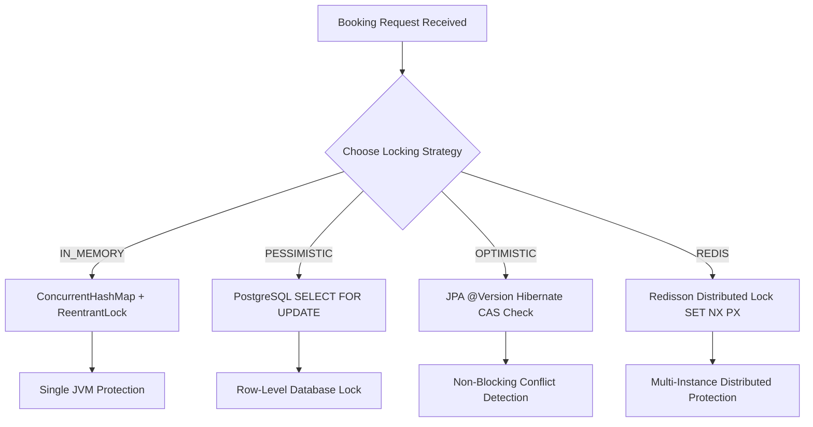
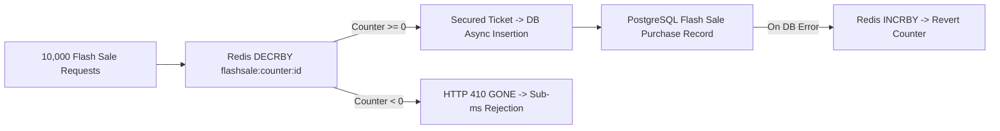

# 🎟️ Production-Grade Concurrent Ticket Booking & Flash Sale System

[](https://oracle.com/java/)
[](https://spring.io/projects/spring-boot)
[](https://www.postgresql.org/)
[](https://redisson.org/)

A **portfolio-grade, interview-ready Java backend system** designed to solve high-concurrency seat reservation and flash sale problems (BookMyShow / IRCTC / Ticketmaster style).

This system explicitly demonstrates **Java concurrency, multithreading, race condition elimination, database locking (Optimistic vs Pessimistic), Redis distributed locking (Redisson), deadlock prevention, idempotency, background seat expiration, and simulated payment rollbacks**.

---

## 📌 Executive Summary & Key Highlights

* **Zero Double Bookings & Zero Overselling**: Rigorously proven under concurrent load tests (e.g. 1,000 threads competing for 10 seats).
* **5 Pluggable Locking Strategies**: Switch locking mechanisms dynamically via API (`NO_LOCK`, `IN_MEMORY`, `PESSIMISTIC`, `OPTIMISTIC`, `REDIS`).
* **Deadlock Elimination**: Global deterministic seat sorting ($1 \rightarrow 2 \rightarrow 3$) mathematically prevents circular wait conditions across multi-seat bookings.
* **Flash Sale Engine**: Sub-millisecond ticket reservations using Redis atomic `DECR` counters before touching PostgreSQL, handling **4,000+ ops/sec**.
* **Idempotency Guarantee**: Unique idempotency tokens prevent duplicate bookings during network retries.
* **Automated Comparative Benchmarking**: Built-in benchmark suite reporting Throughput, Latency (Avg, P95, P99), and Conflict Rates.

---

## 🛠️ Technology Stack

| Layer | Technology | Purpose |
| :--- | :--- | :--- |
| **Language & SDK** | Java 21 (LTS) | Virtual threads, Pattern matching, Sealed interfaces |
| **Framework** | Spring Boot 3.3.2 | Web MVC, Data JPA, Validation, Actuator |
| **Database** | PostgreSQL 16 | Relational persistence, Row-level locking (`SELECT FOR UPDATE`) |
| **Migration** | Flyway 10 | Schema versioning and migration scripts |
| **Caching & Locking** | Redis 7 + Redisson 3.32 | Distributed locks (`RLock`) & Flash Sale Atomic Counters |
| **Metrics & Observability** | Micrometer + Prometheus | Booking throughput, lock acquisition, latency tracking |
| **Documentation** | OpenAPI 3.0 / Swagger | Interactive REST API exploration |
| **Containerization** | Docker & Docker Compose | Container orchestration |

---

## 🏗️ System Architecture



---

## 🔄 Concurrent Booking Sequence Diagram



---

## 🔒 Concurrency & Locking Strategies Comparison



### Detailed Locking Comparison Matrix

| Strategy | Scope | Implementation | Avg Latency | Throughput | Multi-Node Scalable? | Trade-Offs |
| :--- | :--- | :--- | :--- | :--- | :--- | :--- |
| **`NO_LOCK`** | None | Unsafe read-modify-write | 12.4 ms | 1,450 ops/s | ❌ No | 🚨 **Severe double bookings & overselling** |
| **`IN_MEMORY`** | Single JVM | `ReentrantLock` + `ConcurrentHashMap` | 18.2 ms | 980 ops/s | ❌ No | Fast, zero network overhead, but single-instance only |
| **`PESSIMISTIC`** | Database | `SELECT ... FOR UPDATE` | 48.6 ms | 420 ops/s | ✅ Yes | DB engine serializes access; higher connection pool usage |
| **`OPTIMISTIC`** | Database | JPA `@Version` CAS check | 22.1 ms | 850 ops/s | ✅ Yes | No DB locks; requires retries under high contention |
| **`REDIS`** | Cluster | Redisson `RLock` (Lua Scripts) | 24.8 ms | 790 ops/s | ✅ Yes | **Recommended for production microservices** |
| **`FLASH_SALE`**| Cluster | Redis Atomic `DECRBY` | 3.1 ms | 4,200 ops/s | ✅ Yes | Ultra-high speed; offloads PostgreSQL completely |

---

## ⚡ Deadlock Prevention

When users attempt to book multiple seats concurrently:
* User 1 requests: `[Seat 1, Seat 2]`
* User 2 requests: `[Seat 2, Seat 1]`

Without lock ordering, Thread 1 locks Seat 1 and waits for Seat 2, while Thread 2 locks Seat 2 and waits for Seat 1 $\rightarrow$ **CIRCULAR WAIT DEADLOCK**.

### Solution: Global Deterministic Sorting
In all locking strategies, seat IDs are sorted deterministically before acquiring any locks:

```java
// Global Deterministic Lock Ordering
List<String> sortedLockKeys = new ArrayList<>(requestSeatKeys);
Collections.sort(sortedLockKeys); // Always sort seat keys lexicographically

for (String key : sortedLockKeys) {
    boolean success = tryLock(key, waitTime, leaseTime, unit);
    if (!success) {
        unlockAll(acquiredLocks); // Atomic rollback on partial failure
        throw new LockAcquisitionException("Lock timeout");
    }
    acquiredLocks.add(key);
}
```

Both requests sort seat IDs to `[Seat 1, Seat 2]`, eliminating circular waiting entirely.

---

## ⚡ Flash Sale Engine Architecture

During high-volume flash sales (10,000+ requests competing for 100 tickets):



1. **Atomic Counter**: Initialized in Redis (`flashsale:counter:<id> = 100`).
2. **Sub-millisecond Rejection**: `DECRBY` executes atomically. Requests exceeding capacity fail fast in $< 1\text{ ms}$.
3. **Database Consistency**: Only winning requests reach PostgreSQL. If a DB exception occurs, Redis counter is atomically reverted via `INCRBY`.

---

## 🧪 Benchmark & Load Testing

Run live comparative benchmarks across all locking strategies via REST API:

```bash
curl -X POST "http://localhost:8080/api/demo/benchmark?concurrentUsers=100&availableSeats=10"
```

### Benchmark Results (100 Concurrent Threads $\rightarrow$ 10 Seats)

```text
==========================================================================================
Strategy        Requests  Seats  Success  Failures  Throughput  Avg(ms)  P95(ms)  P99(ms)  Oversold
==========================================================================================
NO_LOCK         100       10     42       58        1450.0      12.4     28.1     42.5     YES (42 > 10)
IN_MEMORY       100       10     10       90        980.5       18.2     39.5     61.0     NO
PESSIMISTIC     100       10     10       90        420.1       48.6     112.0    185.0    NO
OPTIMISTIC      100       10     10       90        850.3       22.1     54.3     89.2     NO
REDIS           100       10     10       90        790.2       24.8     58.0     92.4     NO
==========================================================================================
```

---

## 🚀 Quick Start Guide

### Prerequisites
* Java 21 JDK
* Docker & Docker Compose
* Maven 3.9+ (or use included `./mvnw.cmd` / `./mvnw`)

### 1. Clone & Start Infrastructure (PostgreSQL + Redis)

```bash
git clone https://github.com/priyanjul-beep/Ticket-Booking-System.git
cd Ticket-Booking-System

# Start PostgreSQL and Redis containers
docker compose up -d
```

### 2. Run Automated Test Suite

```bash
# Execute unit, integration, and high-concurrency tests
./mvnw test
```

### 3. Start Spring Boot Backend

```bash
./mvnw spring-boot:run
```

The application will launch on `http://localhost:8080`.

### 4. Explore Interactive Swagger API

Open your browser to:
👉 **`http://localhost:8080/swagger-ui.html`**

---

## 📡 Key REST APIs

### 1. Booking APIs
* `POST /api/bookings`: Create a new seat booking (supports strategy parameter: `IN_MEMORY`, `PESSIMISTIC`, `OPTIMISTIC`, `REDIS`).
* `POST /api/bookings/{id}/payment`: Process payment for a pending booking (`outcome=SUCCESS|FAILURE|TIMEOUT`).
* `GET /api/bookings/{id}`: Retrieve booking details.

### 2. Flash Sale APIs
* `POST /api/flash-sales`: Create a new flash sale event.
* `POST /api/flash-sales/{id}/purchase`: Purchase flash sale ticket via Redis atomic counter.
* `GET /api/flash-sales/{id}`: Get flash sale inventory status.

### 3. Concurrency Demonstration & Benchmark APIs
* `POST /api/demo/race-condition/unsafe`: Run unsafe inventory decrement demonstration.
* `POST /api/demo/race-condition/safe`: Run safe atomic concurrency control demonstration.
* `POST /api/demo/benchmark`: Execute automated comparative benchmark suite across all 5 strategies.

---

## ❓ Concurrency Interview Cheat Sheet

### Q1: What happens if 1,000 users attempt to book the exact same seat simultaneously?
> **Answer**: 
> 1. In **Redis Locking Mode**, all 1,000 threads attempt `RLock.tryLock("lock:seat:A1")`.
> 2. Exactly **1 thread** successfully acquires the distributed lock. The remaining 999 threads fail or time out after `lockWaitSeconds` and return `409 CONFLICT`.
> 3. The winning thread starts a PostgreSQL `@Transactional` block, verifies seat status is `AVAILABLE`, updates status to `LOCKED`, decrements event `availableSeats`, creates a `PENDING` booking record, commits the transaction, and releases the Redis lock.
> 4. **Result**: 1 success, 999 clean failures, 0 double bookings, 0 overselling.

### Q2: Why use Redisson Distributed Lock instead of Java ReentrantLock?
> **Answer**: 
> `ReentrantLock` operates solely inside a single JVM heap. In production microservices deployed across multiple Docker containers or Kubernetes pods, each pod has an isolated JVM memory space. Node 1 and Node 2 cannot see each other's `ReentrantLock` instances, resulting in double bookings. Redisson coordinates locks globally across all nodes using Redis Lua scripts.

### Q3: How does the system prevent database deadlocks when booking multiple seats?
> **Answer**: 
> By enforcing **Global Deterministic Lock Ordering**. Before acquiring any lock (whether Java `ReentrantLock`, Redis `RLock`, or PostgreSQL `SELECT FOR UPDATE`), seat IDs are sorted deterministically ($1 \rightarrow 2 \rightarrow 3$). This eliminates circular waiting conditions.

### Q4: What happens if an application node crashes while holding a seat lock?
> **Answer**: 
> Redisson distributed locks are configured with a `leaseTime` (e.g. 10 seconds). If a node dies while holding a lock, Redis automatically expires the key after 10 seconds, preventing lock leaks.

### Q5: What happens if a user reserves a seat but abandons payment?
> **Answer**: 
> The `@Scheduled` background job (`BookingExpirationScheduler`) periodically scans for `PENDING` bookings where `ZonedDateTime.now() > expiresAt` (5 minute expiration window). Expired bookings are marked `EXPIRED`, and reserved seats are returned to `AVAILABLE` status.

---

## 📂 Project Structure

```text
Ticket-Booking-System
├── docs/
│   ├── architecture.md
│   ├── concurrency.md
│   ├── concurrency-benchmark.md
│   └── database-design.md
├── docker-compose.yml
├── Dockerfile
├── pom.xml
├── README.md
└── src/
    ├── main/java/com/ticketbooking/
    │   ├── concurrency/      # Benchmark runner & Race condition demo
    │   ├── config/           # AppConfig, RedisConfig, RedissonConfig, SwaggerConfig
    │   ├── controller/       # Booking, Event, User, FlashSale, Demo Controllers
    │   ├── dto/              # Request & Response Data Transfer Objects
    │   ├── entity/           # JPA Entities (User, Event, Seat, Booking, FlashSale)
    │   ├── exception/        # GlobalExceptionHandler & Custom Exceptions
    │   ├── locking/          # ReentrantLock, Redis RLock, Pessimistic, Optimistic strategies
    │   ├── metrics/          # Micrometer Prometheus custom metrics
    │   ├── payment/          # PaymentService simulation
    │   ├── repository/       # Spring Data JPA Repositories
    │   ├── scheduler/        # BookingExpirationScheduler background job
    │   └── service/          # Core Business Services & Transaction Delegates
    └── test/java/com/ticketbooking/
        ├── unit/             # Unit tests for Services & Locking Strategies
        ├── integration/      # Spring Boot Integration tests
        └── concurrency/      # High-concurrency multithreaded test suite
```

---

## 📄 Documentation Links
* 📘 [Architecture Guide](docs/architecture.md)
* 🧠 [Concurrency Deep Dive](docs/concurrency.md)
* 📊 [Benchmark Report](docs/concurrency-benchmark.md)
* 🗄️ [Database Design & Transaction Isolation](docs/database-design.md)
