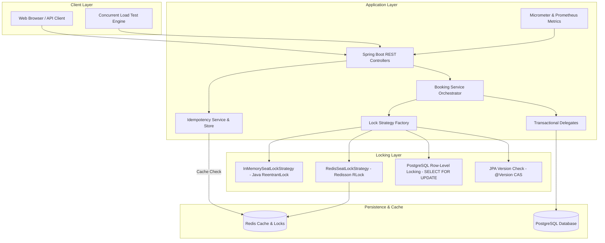
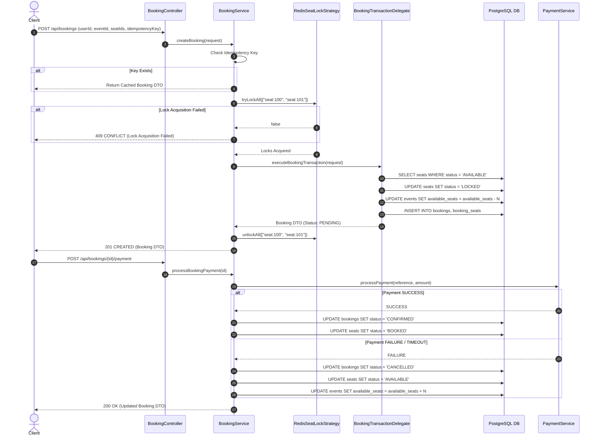

# System Architecture — Concurrent Ticket Booking System

## Executive Summary

This application is built to demonstrate high-concurrency ticket booking and flash-sale mechanics in Java 21 and Spring Boot 3. It handles thousands of concurrent requests attempting to reserve limited event seats safely without double booking, overselling, or database corruption.

---

## High-Level Architecture Diagram

---

## System Component Breakdown

### 1. Controllers (`com.ticketbooking.controller`)
- **`BookingController`**: REST APIs for creating bookings, retrieving booking status, and processing payments.
- **`EventController`**: Event creation, retrieving available seats, and event metadata.
- **`UserController`**: User management.
- **`FlashSaleController`**: Flash sale creation, purchasing tickets via Redis counter, retrieving sale metrics.
- **`DemoController`**: Interactive endpoints for running race condition demonstrations and automated comparative lock benchmarks.

### 2. Service Layer (`com.ticketbooking.service`)
- **`BookingService`**: Central orchestrator. Validates requests, enforces idempotency, acquires locks via configured strategy, and handles payments.
- **`BookingTransactionDelegate`**: Spring bean isolating `@Transactional` operations (`READ_COMMITTED` isolation) to guarantee Spring AOP proxy interception when called after lock acquisition.
- **`FlashSaleService`**: Manages high-throughput flash sales using Redis atomic `DECR` counters before hitting the database.
- **`FlashSaleTransactionDelegate`**: Handles database persistence for flash sale purchases.
- **`IdempotencyService`**: Stores and checks idempotency keys to ensure duplicate requests return identical responses.
- **`InventoryService`**: Manages event seat counts using safe atomic SQL queries.

### 3. Locking Layer (`com.ticketbooking.locking`)
- **`SeatLockStrategy`**: Common locking interface (`tryLock`, `unlock`, `tryLockAll`, `unlockAll`).
- **`InMemorySeatLockStrategy`**: Java `ReentrantLock` using `ConcurrentHashMap`. Lock keys are sorted lexicographically before acquiring to prevent deadlocks.
- **`RedisSeatLockStrategy`**: Redisson `RLock` backed by Redis Lua scripts. Provides lease timeouts and automatic unlock capabilities across multiple app instances.
- **`NoOpSeatLockStrategy`**: Used when locking is handled at database level (Pessimistic / Optimistic) or for unsafe `NO_LOCK` benchmarking.
- **`LockStrategyFactory`**: Factory component resolving the appropriate strategy dynamically based on API request parameters.

### 4. Scheduler & Payment (`com.ticketbooking.scheduler`, `com.ticketbooking.payment`)
- **`BookingExpirationScheduler`**: Scheduled background job (`@Scheduled(cron = "0 * * * * *")`) scanning for `PENDING` bookings exceeding 5 minutes, automatically releasing reserved seats back to `AVAILABLE`.
- **`PaymentService`**: Simulated payment gateway returning deterministic or randomized `SUCCESS`, `FAILURE`, or `TIMEOUT` states with full transaction rollback on failure.

---

## Request Flow Sequence

