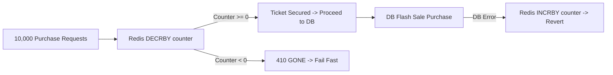

# Concurrency & Locking Deep Dive

## Introduction

In high-throughput ticketing systems (e.g. BookMyShow, IRCTC, Ticketmaster), thousands of concurrent requests hit the backend to reserve a small, finite set of seats. Without proper concurrency control, systems suffer from:
1. **Double Booking**: Two users successfully book the exact same seat.
2. **Overselling**: Total booked tickets exceed event capacity.
3. **Lost Updates**: Concurrent read-modify-write operations overwrite each other's state.
4. **Deadlocks**: Concurrent multi-resource lock acquisitions block each other indefinitely in a circular wait.

This system demonstrates the implementation, behavior, advantages, and trade-offs of **4 major locking strategies** plus **Redis Flash Sale Counters**.

---

## 1. Race Conditions & Unsafe Inventory Decrements

### The Problem: Read-Modify-Write Race Condition

Consider the following naive code pattern:

```java
// UNSAFE INVENTORY DECREMENT
Integer currentAvailable = jdbcTemplate.queryForObject(
    "SELECT available_seats FROM events WHERE id = 1", Integer.class);

if (currentAvailable > 0) {
    Thread.sleep(1); // Small window simulating business processing
    jdbcTemplate.update(
        "UPDATE events SET available_seats = ? WHERE id = 1", currentAvailable - 1);
}
```

When 1,000 threads execute this code simultaneously:
1. Thread 1 to 50 all read `available_seats = 100` at time $t_0$.
2. All 50 threads calculate `100 - 1 = 99`.
3. All 50 threads write `available_seats = 99` to PostgreSQL.
4. Result: 50 seats were granted to users, but `available_seats` was only decremented by 1!
5. Inventory count is corrupted, and tickets are heavily oversold.

### The Solution: Safe Atomic SQL Update

```sql
UPDATE events
SET available_seats = available_seats - 1
WHERE id = :eventId AND available_seats >= 1;
```

PostgreSQL acquires a row-level write lock during the execution of this `UPDATE` query. The database engine serializes updates to the row, ensuring that each decrement sees the exact committed state left by the preceding transaction.

---

## 2. Comparison of Locking Strategies

### Strategy 1: In-Memory Java ReentrantLock

```java
public class InMemorySeatLockStrategy implements SeatLockStrategy {
    private final ConcurrentHashMap<String, ReentrantLock> lockMap = new ConcurrentHashMap<>();

    public boolean tryLock(String resourceId, long waitTime, long leaseTime, TimeUnit unit) throws InterruptedException {
        ReentrantLock lock = lockMap.computeIfAbsent(resourceId, k -> new ReentrantLock(true)); // Fair lock
        return lock.tryLock(waitTime, unit);
    }
}
```

- **How It Works**: Uses JVM `ReentrantLock` instances stored inside a thread-safe `ConcurrentHashMap`. Lock striping dynamically creates locks per seat key.
- **Why It Is Useful**: Provides zero network latency overhead and strict FIFO lock fairness inside a single JVM.
- **Limitations**: **Single-JVM only**. If the application is deployed across $N$ Docker containers or Kubernetes pods, each container has an isolated JVM memory space. Container A and Container B cannot see each other's `ReentrantLock` instances, leading to double bookings.

---

### Strategy 2: Database Pessimistic Locking (`SELECT FOR UPDATE`)

```java
@Lock(LockModeType.PESSIMISTIC_WRITE)
@Query("SELECT s FROM Seat s WHERE s.id IN :ids")
List<Seat> findAllByIdWithPessimisticLock(@Param("ids") List<Long> ids);
```

- **How It Works**: Issues a SQL `SELECT ... FOR UPDATE` query inside an active `@Transactional` block. PostgreSQL locks the targeted seat rows in exclusive mode.
- **Behavior**: Other concurrent transactions attempting to read or update the same seat rows are blocked at the database engine level until the holding transaction commits or rolls back.
- **Why It Is Useful**: Works seamlessly across multiple application instances without external caching infrastructure.
- **Limitations**: Increases database CPU utilization and connection pool consumption under high concurrency. Long-running locks can exhaust database connection pools.

---

### Strategy 3: Database Optimistic Locking (`@Version`)

```java
@Entity
public class Seat {
    @Id
    private Long id;

    @Version
    private Long version;
}
```

- **How It Works**: No database locks are acquired on read. When Hibernate issues the `UPDATE` query, it appends a version predicate:
  ```sql
  UPDATE seats SET status = 'LOCKED', version = version + 1 WHERE id = 100 AND version = 0;
  ```
- **Conflict Handling**: If another transaction updated row 100 in the interim, the version is already 1. The `UPDATE` query matches 0 rows. Hibernate throws `OptimisticLockException` or `ObjectOptimisticLockingFailureException`.
- **Global Exception Handler**: Caught by `@RestControllerAdvice` and converted into an HTTP `409 CONFLICT` response: `"The seat was updated by another concurrent user. Please try again."`
- **Why It Is Useful**: Maximum throughput for read-heavy workloads where collision rates are low.
- **Limitations**: High retry rates required under extreme contention (e.g. Flash Sales), as failed transactions roll back and must be retried by the client.

---

### Strategy 4: Redis Distributed Locking (Redisson)

```java
RLock lock = redissonClient.getLock("lock:seat:100");
boolean acquired = lock.tryLock(waitTime, leaseTime, TimeUnit.SECONDS);
```

- **How It Works**: Redisson uses Redis Lua scripts evaluating `SET NX PX` commands to acquire non-blocking distributed locks across all application instances.
- **Lease Time & Watchdog**: `leaseTime` (e.g. 10 seconds) prevents lock leaks. If an application instance crashes while holding a lock, Redis automatically expires the key after the lease duration.
- **Why It Is Useful**: **Works across N application instances** while offloading locking overhead away from PostgreSQL to high-speed in-memory Redis.

---

## 3. Deadlock Prevention Strategy

### The Deadlock Risk

If two users attempt to book multiple seats simultaneously:
- User A requests `[Seat 1, Seat 2]`
- User B requests `[Seat 2, Seat 1]`

Without lock ordering:
1. User A acquires Lock on `Seat 1`.
2. User B acquires Lock on `Seat 2`.
3. User A waits for Lock on `Seat 2` (held by User B).
4. User B waits for Lock on `Seat 1` (held by User A).
5. **CIRCULAR WAIT DEADLOCK** — both threads block until timeout.

### The Solution: Global Deterministic Lock Ordering

In **all** locking implementations (`InMemorySeatLockStrategy`, `RedisSeatLockStrategy`, and `BookingTransactionDelegate`), seat resource IDs are sorted deterministically prior to lock acquisition:

```java
// SORT SEAT IDs LEXICOGRAPHICALLY / NUMERICALLY
List<String> sortedIds = new ArrayList<>(resourceIds);
Collections.sort(sortedIds);

for (String id : sortedIds) {
    boolean success = tryLock(id, waitTime, leaseTime, unit);
    if (!success) {
        unlockAll(acquiredLocks); // Partial failure rollback
        return Collections.emptyList();
    }
    acquiredLocks.add(id);
}
```

With deterministic sorting:
- User A requests `[Seat 1, Seat 2]` $\rightarrow$ locks `Seat 1`, then `Seat 2`.
- User B requests `[Seat 2, Seat 1]` $\rightarrow$ sorted to `[Seat 1, Seat 2]` $\rightarrow$ locks `Seat 1`, then `Seat 2`.

User B must wait for User A to finish `Seat 1`. Circular wait is mathematically eliminated.

---

## 4. Flash Sale High-Throughput Architecture

During flash sales, 10,000+ requests compete for 100 tickets in milliseconds.



1. **Redis Atomic Counter**: On flash sale creation, Redis key `flashsale:counter:<id>` is initialized to total available tickets (e.g. 100).
2. **Sub-Millisecond Rejection**: Requests execute atomic `DECRBY key quantity`. If the remaining balance is $< 0$, the request fails fast in $< 1\text{ ms}$ without hitting PostgreSQL.
3. **DB Consistency**: Only requests that successfully decrement the Redis counter are allowed to persist purchase records in PostgreSQL. If DB insertion fails, the Redis counter is atomically incremented back (`INCRBY`).
