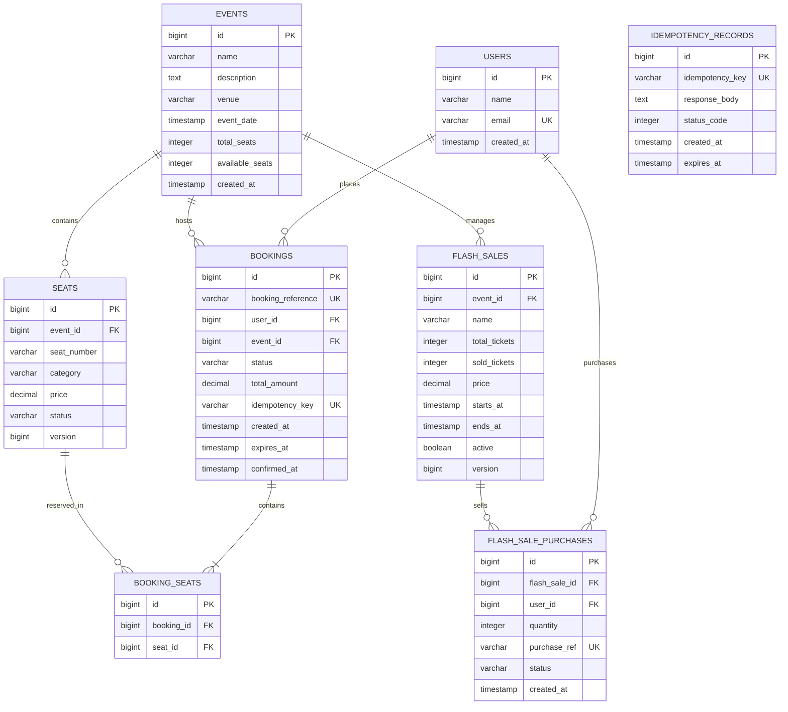

# Database Design & Transaction Isolation Guide

## 1. Entity-Relationship (ER) Diagram

---

## 2. Table Schemas & Constraints

### Primary & Foreign Keys
- All entities use auto-incrementing `BIGINT` primary keys (`BIGSERIAL` in PostgreSQL).
- Foreign keys maintain Referential Integrity with `ON DELETE RESTRICT` or `CASCADE`.

### Unique Constraints
- `users(email)`: Prevents duplicate user registrations.
- `bookings(booking_reference)`: Guarantees unique, human-readable booking tracking tokens (e.g. `BK-8F3A29B1`).
- `bookings(idempotency_key)`: Database-level safety net guaranteeing duplicate requests with the same key cannot create duplicate bookings.
- `flash_sale_purchases(purchase_ref)`: Unique purchase reference token.
- `idempotency_records(idempotency_key)`: Ensures idempotency lookup table uniqueness.

### Indexes for High-Concurrency Performance
1. `idx_seats_event_status`: `(event_id, status)` $\rightarrow$ Accelerates querying available seats for an event.
2. `idx_bookings_user`: `(user_id)` $\rightarrow$ Speeds up user booking history queries.
3. `idx_bookings_status_expires`: `(status, expires_at)` $\rightarrow$ Essential for the background expiration scheduler to scan `PENDING` bookings without full table scans.
4. `idx_idempotency_key`: `(idempotency_key)` $\rightarrow$ Instant $O(1)$ lookup for duplicate request filtering.

---

## 3. PostgreSQL Transaction Isolation Levels

PostgreSQL supports 3 isolation levels:

1. **`READ COMMITTED` (System Default & Used in Booking System)**
   - **Behavior**: A query sees only data committed before the query began.
   - **Dirty Reads**: Prevented.
   - **Non-Repeatable Reads**: Possible within long multi-statement transactions.
   - **Phantom Reads**: Possible within long multi-statement transactions.
   - **Why Used Here**: `READ COMMITTED` combined with explicit row locking (`SELECT FOR UPDATE`) or optimistic concurrency control (`@Version`) gives maximum concurrency and minimal lock overhead without the performance penalty or serialization failures of `SERIALIZABLE`.

2. **`REPEATABLE READ`**
   - **Behavior**: All queries in a transaction see a snapshot taken at the start of the transaction.
   - **Phantom Reads**: Prevented in PostgreSQL.
   - **Serialization Anomalies**: Still possible.

3. **`SERIALIZABLE`**
   - **Behavior**: Guarantees that concurrent transaction execution is identical to serial (one-by-one) execution.
   - **Trade-off**: High probability of `SerializationFailure` exceptions under high concurrency requiring aggressive client-side application retries. Not recommended for seat booking where fine-grained row locks or Redis distributed locks handle conflict serialization much more efficiently.

---

## 4. Concurrency Phenomenon Matrix

| Isolation Level | Dirty Read | Non-Repeatable Read | Phantom Read | Serialization Anomaly |
| :--- | :--- | :--- | :--- | :--- |
| **Read Uncommitted** | Allowed (N/A in Postgres) | Allowed | Allowed | Allowed |
| **Read Committed** (Default) | Prevented | Allowed | Allowed | Allowed |
| **Repeatable Read** | Prevented | Prevented | Prevented (in Postgres) | Allowed |
| **Serializable** | Prevented | Prevented | Prevented | Prevented |
